## 1. Product Overview
Implement the CACSMS Autonomous Visual Intelligence and Image Generation Engine as a production-ready, autonomous, database-backed visual-generation platform inside the existing CACSMS Autonomous Media Studio.
- The system must use the current CACSMS stack and shell while adding real visual intelligence, orchestration, generation, validation, repair, provenance, routing, and operational telemetry with no mock outputs or fake progress.
- The product value is a fully autonomous visual-production engine that claims storyboard-driven asset requests, generates and validates real assets, repairs failures, and routes approved outputs into the production lifecycle without normal human prompt entry or candidate selection.

## 2. Core Features

### 2.1 User Roles
| Role | Registration Method | Core Permissions |
|------|---------------------|------------------|
| Operator | Existing CACSMS user/session model | View queue, health, telemetry, and autonomous progress |
| Administrator | Existing CACSMS admin session model | Manual override, audited restart, exception handling, rights-sensitive intervention |
| Autonomous Visual Agent | Internal service identity | Claim jobs, resolve briefs, route models, generate candidates, validate, repair, persist, route, and learn |
| GPU Worker | Internal service identity | Run model workflows, maintain lease/heartbeat, report metrics and results |

### 2.2 Feature Module
1. **Visual Foundation**: persistent MSSQL schema, provider abstraction, asset storage, queue, technical validation, delivery verification.
2. **Autonomous Workflow**: job claiming, storyboard request intake, visual brief resolution, prompt intelligence, model routing, candidate generation, candidate selection, automatic routing.
3. **Quality and Repair**: hard-gate QA, semantic inspection, inpainting, outpainting, super-resolution, retries, fallback logic.
4. **Consistency Intelligence**: Character Studio, Character Consistency, Regional Visual Intelligence, Environment Studio, Object and Prop Studio, Historical Reconstruction, adapter governance.
5. **Production Hardening**: GPU monitoring, service health, circuit breakers, telemetry, rights and provenance, learning records, backup and recovery.
6. **Visual Studio Surfaces**: dedicated routes, permissions, breadcrumbs, page-level status, and audit trail for all Visual Studio pages specified in `prompt.txt`.

### 2.3 Page Details
| Page Name | Module Name | Feature description |
|-----------|-------------|---------------------|
| Visual Dashboard | Operational Summary | Shows real queued, active, completed, failed, repaired, rejected, blank, corrupt, quality, cost, worker, model, health, storage, coverage, exception, and ranking telemetry from persisted records |
| Autonomous Image Generator | Active Job Workspace | Shows current production, scene, request, queue state, worker, model, workflow, regional profile, characters, references, candidates, quality, defects, recovery, storage, delivery, routing, version history, and agent decisions |
| Generation Queue | Queue Operations | Shows queued, claimed, active, retrying, blocked, dead-letter, completed, cancelled jobs with filtering by production, project, scene, status, asset type, provider, model, worker, quality result, and date range |
| Visual Brief Resolver | Brief Contract | Converts narrative and storyboard inputs into a persisted, versioned `ResolvedVisualBrief` contract before generation starts |
| Prompt Intelligence | Prompt Composition | Builds canonical, model-specific, negative, character, regional, correction, inpainting, outpainting, upscaling, and QA prompts from resolved briefs and validates completeness before use |
| Character Studio | Identity Definition | Stores permanent synthetic character identity, rights, reference sheets, approved references, embeddings, adapters, and seeds |
| Character Consistency | Cross-Scene Identity | Scores and enforces recurring-character identity across generated candidates and approved assets |
| Regional Visual Intelligence | Regional Accuracy | Stores region-specific environmental and cultural profiles, approved evidence, stereotypes to avoid, and confidence-based conditioning data |
| Environment Studio | Recurring Locations | Defines recurring environments, lighting, palette, season, references, and scene links for consistent generation |
| Object and Prop Studio | Prop Governance | Stores reusable objects and props, reference evidence, rights, required accuracy, and scene usage |
| Historical Reconstruction | Period Accuracy | Stores and evaluates historically accurate references, environments, clothing, and contradiction checks |
| Model and Workflow Manager | Provider Governance | Manages providers, models, workflows, capabilities, latency, cost, licensing, and deployment health |
| Reference Conditioning | Reference Governance | Stores approved reference-conditioning assets, embeddings, reference types, approval state, and generation eligibility |
| Image Repair and Enhancement | Local Repair | Performs mask creation, face/hand/object inpainting, outpainting, restoration, colour correction, sharpening, and upscaling while preserving prior approved versions |
| Visual QA | Quality Gates | Runs technical validation, blank-image detection, semantic inspection, hard gates, weighted scoring, and rejection recording |
| Rights and Provenance | Rights Governance | Records training/reference/generation/publication rights, consent, provenance chain, safety decisions, and reproducibility metadata |
| Visual Versions | Asset Versioning | Shows immutable generated, repaired, upscaled, approved, rejected, quarantined, and superseded versions |
| Export | Delivery Packaging | Exports approved assets in channel-aware formats with rights-aware constraints and delivery tracking |

## 3. Core Process
The visual engine must operate as a strict autonomous workflow. A production reaches the Produce stage, Storyboard emits an asset request, the Visual Agent claims the highest-priority eligible job atomically, loads all required script/storyboard/character/regional/environment/brand/reference context, persists a versioned visual brief, composes model-ready prompts, routes the job to the best model and workflow, generates multiple real candidates, performs technical validation and semantic inspection, repairs defects when feasible, upscales the approved image, verifies storage and browser delivery separately, records complete provenance and rights metadata, updates storyboard and asset requirement state, routes the approved asset downstream, and advances lifecycle progress only when every hard gate passes.

```mermaid
flowchart LR
  A["Storyboard emits asset request"] --> B["Visual Agent claims highest-priority eligible job atomically"]
  B --> C["Load script, scene, characters, references, regional and brand context"]
  C --> D["Persist versioned ResolvedVisualBrief"]
  D --> E["Generate validated model-specific prompts"]
  E --> F["Model Router selects provider, model, workflow, adapters, and controls"]
  F --> G["Generate multiple real preview candidates"]
  G --> H["Run technical validation and blank-image detection"]
  H --> I["Run semantic quality inspection and hard gates"]
  I --> J["Repair or regenerate if defects exist"]
  J --> K["Render production-quality asset and upscale"]
  K --> L["Persist immutable asset, thumbnail, checksum, provenance, and rights"]
  L --> M["Verify delivery and browser accessibility"]
  M --> N["Route approved asset to storyboard, asset library, and downstream stages"]
  N --> O["Record learning, telemetry, and state completion"]
```

## 4. User Interface Design
### 4.1 Design Style
- Preserve the current CACSMS white-surface enterprise design language, existing sidebar, global styling, lifecycle shell, and route conventions
- Use dense operational telemetry rather than decorative filler; every panel must expose truthful, persisted status
- Keep primary accents aligned to the existing Visual Studio system: strong operational greens, warning ambers, critical reds, slate neutrals, and selective violet for active workflow emphasis
- Buttons remain compact, functional, and enterprise-grade with clear hover states and role-aware controls
- Icons should use `lucide-react` and visually distinguish orchestration, quality, health, repair, and routing states

### 4.2 Page Design Overview
| Page Name | Module Name | UI Elements |
|-----------|-------------|-------------|
| Visual Dashboard | Executive Telemetry | KPI strips, job-state breakdowns, worker health, provider health, model rankings, cost cards, service health, exception feed |
| Autonomous Image Generator | Command Workspace | Top status area, strict stage flow, left brief/evidence rail, center candidate/render area, right agent/QA/routing rail, bottom version/history/provenance section |
| Generation Queue | Queue Console | Dense table, status tabs, filters, priority markers, worker lease info, retry timing, blocking reason, dead-letter visibility |
| Visual Brief Resolver | Contract Inspector | Structured contract viewer, version history, upstream evidence, required/prohibited elements, composition and camera specification |
| Prompt Intelligence | Prompt Inspector | Canonical prompt, model-specific variations, negative prompt, prompt validation, unresolved-variable gates, version comparison |
| Character Studio | Identity Workspace | Reference-sheet gallery, synthetic identity panels, wardrobe profiles, embeddings/adapters metadata, rights state |
| Character Consistency | Consistency Review | Identity scorecards per candidate, failure reasons, wardrobe/accessory comparisons, prior approved references |
| Regional Visual Intelligence | Regional Knowledge | Region profile cards, evidence list, stereotype guardrails, confidence and approval state |
| Model and Workflow Manager | Model Registry | Provider cards, supported operations, capabilities, health, latency, cost, licensing, fallback relationships |
| Image Repair and Enhancement | Repair Pipeline | Before/after comparisons, repair strategy log, targeted masks, enhancement attempts, immutable version lineage |
| Visual QA | Quality Board | Not-evaluated state, dimension scores, hard-gate outcomes, defect taxonomy, weighted scoring, pass/fail rationale |
| Rights and Provenance | Governance Ledger | Rights classifications, consent state, provenance chain, model/workflow/prompt lineage, reproducibility metadata |

### 4.3 Responsiveness
- Desktop-first control-room layouts remain the priority across operational pages
- Core tables and multi-column workspaces collapse into readable stacked sections on smaller widths without hiding critical telemetry
- Candidate grids, right-rail QA panels, and worker health cards should reorganize responsively while keeping operational state visible

## 5. Non-Negotiable Product Rules
1. No mock images, stock placeholders, fake queues, fake scores, fake models, fake GPU health, fake progress, or fake history.
2. No job may be marked successful until real bytes exist, file format and dimensions are valid, blank/corrupt checks pass, storage succeeds, checksum exists, delivery URL works, and quality gates pass.
3. Generation, technical validation, quality inspection, storage, delivery, and browser acknowledgement are separate states and must not be conflated.
4. The system must use a strict persistent state machine and record every transition, decision, attempt, error, repair, and retry.
5. The implementation must retain the current CACSMS application structure and extend it; it must not replace the shell, sidebar, or main business controller.

## 6. Implementation Order
1. **Phase 1: Foundation**
   Create database entities, provider abstraction, inference service, one real image model integration, asset storage, persistent queue, technical validation, real browser image delivery, and eliminate blank-image success states.
2. **Phase 2: Autonomous Workflow**
   Implement atomic claiming, Storyboard request intake, Visual Brief Resolver, Prompt Intelligence, Model Router, multi-candidate generation, automatic candidate selection, and approved-asset routing.
3. **Phase 3: Quality and Repair**
   Implement semantic QA, hard gates, inpainting, outpainting, upscaling, retries, repair policy, and provider fallback.
4. **Phase 4: Consistency**
   Implement Character Studio, reference conditioning, identity embeddings, ControlNet, Regional Visual Intelligence, Environment Studio, Object and Prop Studio, and LoRA governance.
5. **Phase 5: Production Hardening**
   Implement GPU monitoring, health checks, circuit breakers, telemetry, rights and provenance, benchmark suite, learning records, backup and recovery, and end-to-end acceptance tests.

## 7. Completion Standard
The work is complete only when a real storyboard asset request can autonomously move through brief resolution, prompt composition, model routing, real candidate generation, technical validation, semantic QA, targeted repair, upscaling, persistence, provenance capture, delivery verification, downstream routing, and lifecycle advancement without manual prompt entry, manual candidate selection, or manual approval in normal mode.
