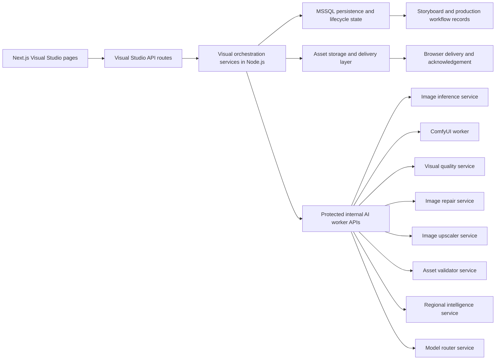
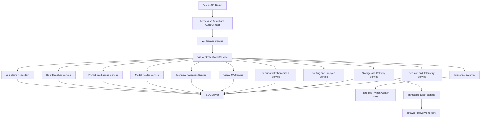
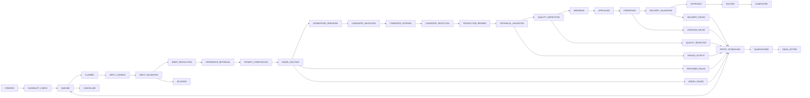

## 1. Architecture Design
The CACSMS Autonomous Visual Intelligence and Image Generation Engine extends the current Next.js App Router workspace, MSSQL-backed orchestration layer, and existing Visual Studio module without replacing the shell, sidebar, route conventions, or lifecycle structure. The main CACSMS application remains the authoritative business controller while internal visual services handle generation, quality, repair, upscaling, validation, and worker operations behind protected internal APIs.



### 1.1 Logical Layers
- Presentation layer: `apps/web/app`, `apps/web/features`, `apps/web/components`, and existing global shell components render truthful queue, job, QA, repair, provenance, and health telemetry.
- Application layer: Next.js route handlers under `apps/web/app/api/visuals` expose authenticated, permission-aware endpoints for workspace reads, orchestrated mutations, SSE, polling, audit history, and asset delivery.
- Domain layer: shared orchestration modules under `apps/web/lib` implement job claiming, brief resolution, prompt composition, model routing, candidate validation, QA scoring, repair policy, provenance capture, routing, and learning records.
- Worker layer: internal services under `services/visual-orchestrator`, `services/image-inference`, `services/comfy-worker`, `services/visual-quality`, `services/image-repair`, `services/image-upscaler`, `services/asset-validator`, `services/regional-intelligence`, and `services/model-router`.
- Data layer: Microsoft SQL Server stores all business entities, queue state, prompt versions, provider metadata, quality records, worker telemetry, and audit trails. Dedicated file storage stores binaries and thumbnails.

### 1.2 Non-Negotiable Architectural Rules
- No displayed image, model status, queue state, worker heartbeat, quality score, repair result, or routing event may originate from mock data.
- Job success requires separate completion of generation, technical validation, quality inspection, storage, delivery validation, and browser acknowledgement where applicable.
- Approved assets are immutable. Every repair, upscale, retry, or new output creates a new version.
- Visual Studio pages must remain database-backed and page-specific, with distinct routes, permissions, breadcrumbs, status, and audit history.
- Normal processing is autonomous. Manual intervention is limited to administrator-only stop, override, cancel, quarantine release, or policy-sensitive review actions.

## 2. Technology Description
- Frontend: Next.js App Router + React + TypeScript + TSX + existing CACSMS shell and CSS patterns.
- Frontend workspace strategy: `apps/web/features/visuals` contains dedicated workspaces instead of generic placeholder scaffolds for operational Visual Studio pages.
- API runtime: Node.js + TypeScript using the existing CACSMS route conventions and authentication/permission model.
- Data access: existing MSSQL connection architecture with transactional SQL Server operations, row locking, foreign keys, indexes, and audit columns.
- Storage: dedicated immutable asset directories for `/generated/previews`, `/generated/candidates`, `/generated/production`, `/generated/repaired`, `/generated/upscaled`, `/generated/thumbnails`, `/generated/rejected`, `/generated/quarantine`, `/generated/masks`, and `/generated/references`.
- Orchestration services: Node.js + TypeScript internal services for queue handling, lifecycle integration, router decisions, worker leasing, and telemetry aggregation.
- AI worker services: Python + FastAPI + PyTorch with Diffusers and ComfyUI headless workflows where appropriate.
- Image processing: Pillow/OpenCV or equivalent for MIME validation, decode checks, blank-image detection, thumbnails, checksums, and repair masks.
- Delivery: IIS-hosted main application continues serving the public app while internal services remain non-public and protected by internal authentication.

## 3. Route Definitions
| Route | Purpose |
|-------|---------|
| `/visuals` | Visual Studio landing page using existing module shell and summary routing |
| `/visuals/image-generator` | Autonomous Image Generator operational workspace for the current active job |
| `/visuals/generation-queue` | Persistent queue operations console for queued, claimed, retrying, blocked, dead-letter, completed, and cancelled jobs |
| `/visuals/visual-brief-resolver` | Versioned `ResolvedVisualBrief` inspection workspace |
| `/visuals/prompt-intelligence` | Prompt composition, model-specific prompt variants, and unresolved-variable validation |
| `/visuals/character-studio` | Synthetic recurring-character identity workspace |
| `/visuals/character-consistency` | Cross-scene identity scoring and failure analysis |
| `/visuals/regional-visual-intelligence` | Regional profile governance and evidence-backed cultural/environment conditioning |
| `/visuals/environment-studio` | Recurring environment definitions and references |
| `/visuals/object-and-prop-studio` | Reusable object and prop governance |
| `/visuals/historical-reconstruction` | Historical profile workspace and contradiction detection |
| `/visuals/illustration-studio` | Illustration generation pipeline with deterministic packaging where needed |
| `/visuals/educational-diagram-studio` | Diagram workspace using factual labels and deterministic text layout |
| `/visuals/infographic-studio` | Infographic generation with programmatic typography and data-safe composition |
| `/visuals/chart-and-data-visuals` | Verified-data chart rendering workspace |
| `/visuals/map-studio` | Verified-geography map rendering workspace |
| `/visuals/presentation-graphics` | Static presentation-graphic generation and layout pipeline |
| `/visuals/product-visuals` | Product-focused generation and rights-aware brand controls |
| `/visuals/thumbnail-studio` | Thumbnail pipeline with deterministic typography composition |
| `/visuals/model-workflow-manager` | Provider, model, workflow, licensing, deployment, and fallback management |
| `/visuals/reference-conditioning` | Reference profile governance for IP-Adapter, pose, environment, style, and storyboard sketch inputs |
| `/visuals/image-repair-enhancement` | Inpainting, outpainting, repair, restoration, and upscaling pipeline workspace |
| `/visuals/brand-style-manager` | Brand visual profile, safe area, prohibited elements, and publication-channel constraints |
| `/visuals/prompt-library` | Reusable prompt pattern library and approved system prompt fragments |
| `/visuals/batch-generation` | Bulk request ingestion and monitoring for approved bulk jobs |
| `/visuals/visual-qa` | Technical validation, semantic scoring, hard gates, and defect breakdowns |
| `/visuals/rights-provenance` | Rights, consent, provenance chain, and publication readiness workspace |
| `/visuals/visual-versions` | Immutable generated/repaired/upscaled/rejected/superseded version history |
| `/visuals/export` | Approved-asset export and delivery packaging |

## 4. API Definitions
### 4.1 Frontend-to-Backend Visual API Surface
| Route | Method | Purpose |
|-------|--------|---------|
| `/api/visuals/image-generator` | `GET` | Returns the current autonomous image generator workspace payload |
| `/api/visuals/image-generator` | `POST` | Performs audited admin-only control actions such as stop, retry, quarantine release, or route replay |
| `/api/visuals/image-generator/events` | `GET` | Streams real-time job, candidate, QA, repair, and routing updates |
| `/api/visuals/image-generator/assets/[assetId]` | `GET` | Delivers a stored generated asset or thumbnail with access checks |
| `/api/visuals/generation-queue` | `GET` | Returns persistent queue records with filters, counts, and worker lease data |
| `/api/visuals/generation-queue/[jobId]` | `GET` | Returns a single job with state history, attempts, candidates, failures, and decisions |
| `/api/visuals/generation-queue/[jobId]` | `POST` | Allows audited admin actions such as cancel, force retry, quarantine, or dead-letter recovery |
| `/api/visuals/briefs` | `GET` | Returns persisted visual briefs and versions |
| `/api/visuals/briefs/[briefId]` | `GET` | Returns a full brief contract including upstream evidence |
| `/api/visuals/prompts` | `GET` | Returns prompt records, versions, validations, and model variants |
| `/api/visuals/qa` | `GET` | Returns quality inspections, dimension scores, defects, and hard-gate results |
| `/api/visuals/studio-infra` | `GET` | Returns infrastructure dashboards covering queue, model router, repair, rights, and health |
| `/api/visuals/studio-infra` | `POST` | Executes audited admin-only infra mutations after awaited permission validation |
| `/api/visuals/providers/health` | `GET` | Returns provider health, worker readiness, circuit-breaker states, and storage health |
| `/api/visuals/references` | `GET` | Returns reference conditioning profiles and approval state |
| `/api/visuals/rights-provenance` | `GET` | Returns rights records, provenance chains, publication status, and reproducibility metadata |
| `/api/visuals/versions` | `GET` | Returns immutable asset version chains and repair/upscale lineage |
| `/api/storyboard/asset-requirements` | `GET` | Returns storyboard-originated asset requests eligible for visual claiming |
| `/api/storyboard/asset-requirements` | `POST` | Emits structured asset requests from Storyboard Studio with awaited mutation access |

### 4.2 Internal Worker APIs
```ts
type VisualJobPriority =
  | "CRITICAL"
  | "HIGH"
  | "NORMAL"
  | "LOW"
  | "BACKGROUND";

type VisualJobState =
  | "CREATED"
  | "ELIGIBILITY_CHECK"
  | "QUEUED"
  | "CLAIMED"
  | "INPUT_LOADING"
  | "INPUT_VALIDATION"
  | "BRIEF_RESOLUTION"
  | "REFERENCE_RETRIEVAL"
  | "PROMPT_COMPOSITION"
  | "MODEL_ROUTING"
  | "GENERATING_PREVIEWS"
  | "CANDIDATE_VALIDATION"
  | "CANDIDATE_SCORING"
  | "CANDIDATE_SELECTION"
  | "PRODUCTION_RENDER"
  | "TECHNICAL_VALIDATION"
  | "QUALITY_INSPECTION"
  | "REPAIRING"
  | "UPSCALING"
  | "PERSISTING"
  | "DELIVERY_VALIDATION"
  | "APPROVED"
  | "ROUTED"
  | "COMPLETED"
  | "BLOCKED"
  | "RETRY_SCHEDULED"
  | "PROVIDER_FAILED"
  | "MODEL_FAILED"
  | "INVALID_OUTPUT"
  | "QUALITY_REJECTED"
  | "STORAGE_FAILED"
  | "DELIVERY_FAILED"
  | "QUARANTINED"
  | "DEAD_LETTER"
  | "CANCELLED";

interface VisualJobClaimRequest {
  workerId: string;
  maxJobs?: number;
  supportedProviders?: string[];
  supportedModels?: string[];
}

interface VisualJobClaimResult {
  claimedJobs: ClaimedVisualJob[];
  checkedAt: string;
}

interface ClaimedVisualJob {
  jobId: string;
  requestId: string;
  productionId: string;
  sceneId: string;
  priority: VisualJobPriority;
  state: VisualJobState;
  attemptCount: number;
  leaseExpiresAt: string;
  correlationId: string;
}

interface ResolvedVisualBrief {
  id: string;
  productionId: string;
  sceneId: string;
  assetRequestId: string;
  purpose: string;
  assetType: string;
  subjectDefinitions: SubjectDefinition[];
  characterIds: string[];
  action: string;
  country?: string;
  region?: string;
  state?: string;
  city?: string;
  environmentProfileId?: string;
  regionalProfileId?: string;
  historicalProfileId?: string;
  propIds: string[];
  wardrobeProfileIds: string[];
  referenceAssetIds: string[];
  mood: string;
  lighting: string;
  composition: CompositionDefinition;
  camera: CameraDefinition;
  styleProfileId: string;
  brandProfileId?: string;
  aspectRatio: string;
  width: number;
  height: number;
  safeArea: SafeAreaDefinition;
  requiredElements: string[];
  prohibitedElements: string[];
  qualityThresholds: QualityThresholds;
  version: number;
  status: string;
}

interface ImageGenerationProvider {
  providerId: string;
  healthCheck(): Promise<ProviderHealth>;
  listModels(): Promise<ModelDescriptor[]>;
  getCapabilities(modelId: string): Promise<ModelCapabilities>;
  generate(request: ImageGenerationRequest): Promise<ImageGenerationResult>;
  edit(request: ImageEditRequest): Promise<ImageGenerationResult>;
  inpaint(request: InpaintingRequest): Promise<ImageGenerationResult>;
  outpaint(request: OutpaintingRequest): Promise<ImageGenerationResult>;
  upscale(request: UpscaleRequest): Promise<UpscaleResult>;
}

interface TechnicalValidationResult {
  mimeType: string;
  fileSizeBytes: number;
  width: number;
  height: number;
  aspectRatio: string;
  isBlank: boolean;
  isCorrupt: boolean;
  isTransparent: boolean;
  pixelVariance: number;
  entropy: number;
  dominantColorPercentage: number;
  thumbnailCreated: boolean;
  checksumCreated: boolean;
  passed: boolean;
  rejectionReasons: string[];
}

interface QualityInspectionResult {
  inspectionId: string;
  candidateId: string;
  status: "NOT_EVALUATED" | "PASSED" | "FAILED";
  weightedScore?: number;
  hardGateFailed: boolean;
  hardGateReasons: string[];
  dimensions: QualityDimensionScore[];
  defects: QualityDefect[];
}
```

### 4.3 Key Response Contracts
```ts
interface AutonomousImageGeneratorPayload {
  currentTime: string;
  autonomousRuntime: string;
  activeProduction: WorkspaceProduction | null;
  currentJob: VisualGenerationJobDto | null;
  selectedModel: VisualModelDto | null;
  gpuReadiness: WorkerReadinessSummary;
  queueLength: number;
  agentStatus: AgentStatusSummary;
  systemHealth: ServiceHealthSummary[];
  autonomousRoutingStatus: RoutingStatusSummary;
  stageFlow: StageFlowStep[];
  brief: ResolvedVisualBrief | null;
  references: ReferenceSummary[];
  candidates: CandidateSummary[];
  selectedCandidate: CandidateSummary | null;
  currentRender: GeneratedAssetSummary | null;
  repairComparison: RepairComparison | null;
  integrityChecks: TechnicalValidationResult | null;
  quality: QualityInspectionResult | null;
  delivery: DeliverySummary | null;
  attempts: AttemptSummary[];
  stateHistory: StateHistoryRecord[];
  versionHistory: AssetVersionSummary[];
  provenance: ProvenanceSummary | null;
  decisions: VisualDecisionSummary[];
  emptyState?: {
    nextPollingTime: string;
    eligibleJobs: number;
    workersReady: number;
    modelsLoaded: number;
    lastSuccessfulGeneration?: string;
    currentServiceHealth: string;
  };
}
```

## 5. Server Architecture Diagram


### 5.1 Service Responsibilities
- Visual orchestration service: owns queue polling, atomic claiming, lease renewal, state transitions, retries, and downstream routing.
- Brief resolver service: converts script, narration, storyboard, brand, character, environment, and regional context into persisted brief versions.
- Prompt intelligence service: produces canonical and model-specific prompts, validates completeness, and stores prompt versions.
- Model router service: chooses provider, model, workflow, adapters, and structural controls based on asset type, complexity, worker health, cost, and benchmark history.
- Inference gateway: abstracts local open-weight models, ComfyUI workflows, Diffusers pipelines, and approved external providers.
- Technical validation service: validates bytes, decoding, dimensions, MIME, aspect ratio, blankness, transparency, thumbnails, and checksums.
- Visual QA service: runs semantic scoring, hard gates, defect taxonomy, and weighted quality dimensions.
- Repair and enhancement service: applies inpainting, outpainting, restoration, sharpening, colour correction, and upscaling without overwriting approved originals.
- Storage and delivery service: writes immutable binaries, thumbnails, checksums, delivery records, and browser acknowledgement records.
- Routing and lifecycle service: updates storyboard asset requests, scene state, production progress, Asset Library, and Video Studio readiness.

## 6. Data Model
### 6.1 Data Model Definition

```mermaid
erDiagram
  VisualGenerationRequest ||--o{ VisualGenerationJob : "creates"
  VisualGenerationJob ||--o{ VisualGenerationStateHistory : "records"
  VisualGenerationJob ||--o{ VisualGenerationAttempt : "contains"
  VisualGenerationJob ||--o{ VisualGenerationCandidate : "produces"
  VisualGenerationJob ||--o{ VisualAgentDecision : "records"
  VisualGenerationJob ||--o{ GenerationFailure : "captures"
  VisualGenerationJob ||--o{ RepairAttempt : "triggers"
  VisualGenerationJob ||--o{ UpscaleAttempt : "triggers"
  VisualGenerationRequest ||--o{ VisualBrief : "resolves into"
  VisualBrief ||--o{ VisualBriefVersion : "versions"
  VisualBrief ||--o{ VisualPrompt : "feeds"
  VisualPrompt ||--o{ VisualPromptVersion : "versions"
  VisualModelProvider ||--o{ VisualModel : "owns"
  VisualModel ||--o{ VisualModelDeployment : "deploys"
  VisualWorkflow ||--o{ VisualWorkflowVersion : "versions"
  CharacterIdentity ||--o{ CharacterReference : "uses"
  CharacterIdentity ||--o{ CharacterEmbedding : "stores"
  RegionalVisualProfile ||--o{ ReferenceConditioningProfile : "supports"
  EnvironmentProfile ||--o{ ReferenceConditioningProfile : "supports"
  ObjectProp ||--o{ ObjectReference : "uses"
  VisualGenerationCandidate ||--|| QualityInspection : "evaluated by"
  QualityInspection ||--o{ QualityDimensionScore : "scores"
  QualityInspection ||--o{ QualityDefect : "detects"
  GeneratedAsset ||--o{ GeneratedAssetVersion : "versions"
  GeneratedAsset ||--o{ AssetThumbnail : "has"
  GeneratedAsset ||--o{ AssetChecksum : "has"
  GeneratedAsset ||--o{ AssetDeliveryRecord : "delivers"
  GeneratedAsset ||--o{ AssetProvenance : "tracks"
  GeneratedAsset ||--o{ AssetRightsRecord : "governs"
  GPUWorker ||--o{ GPUWorkerHeartbeat : "emits"
  GPUWorker ||--o{ GPUWorkerMetric : "reports"
  VisualModelProvider ||--o{ ProviderHealthRecord : "reports"
  VisualModel ||--o{ ModelBenchmark : "benchmarked by"
  ModelBenchmark ||--o{ ModelBenchmarkResult : "stores"
  GeneratedAssetVersion }o--|| VisualGenerationCandidate : "derived from"
```


### 6.2 Data Definition Language
```sql
CREATE TABLE dbo.VisualGenerationRequest (
  Id UNIQUEIDENTIFIER NOT NULL PRIMARY KEY,
  ProductionId NVARCHAR(64) NOT NULL,
  SceneId NVARCHAR(64) NOT NULL,
  RequestingModule NVARCHAR(64) NOT NULL,
  AssetType NVARCHAR(64) NOT NULL,
  Purpose NVARCHAR(256) NOT NULL,
  Priority NVARCHAR(32) NOT NULL,
  Status NVARCHAR(32) NOT NULL,
  SubjectJson NVARCHAR(MAX) NULL,
  ContextJson NVARCHAR(MAX) NULL,
  QualityThreshold INT NOT NULL,
  EligibleAt DATETIME2 NOT NULL,
  CreatedAt DATETIME2 NOT NULL,
  UpdatedAt DATETIME2 NOT NULL,
  CreatedByAgent NVARCHAR(128) NOT NULL,
  UpdatedByAgent NVARCHAR(128) NOT NULL,
  Version INT NOT NULL,
  IsDeleted BIT NOT NULL DEFAULT 0
);

CREATE TABLE dbo.VisualGenerationJob (
  Id UNIQUEIDENTIFIER NOT NULL PRIMARY KEY,
  RequestId UNIQUEIDENTIFIER NOT NULL,
  ProductionId NVARCHAR(64) NOT NULL,
  SceneId NVARCHAR(64) NOT NULL,
  Priority NVARCHAR(32) NOT NULL,
  State NVARCHAR(32) NOT NULL,
  GenerationStatus NVARCHAR(32) NOT NULL,
  TechnicalValidationStatus NVARCHAR(32) NOT NULL,
  QualityStatus NVARCHAR(32) NOT NULL,
  StorageStatus NVARCHAR(32) NOT NULL,
  DeliveryStatus NVARCHAR(32) NOT NULL,
  BrowserAcknowledgementStatus NVARCHAR(32) NOT NULL,
  ClaimedByWorkerId UNIQUEIDENTIFIER NULL,
  ClaimedAt DATETIME2 NULL,
  LeaseExpiresAt DATETIME2 NULL,
  HeartbeatAt DATETIME2 NULL,
  AttemptCount INT NOT NULL DEFAULT 0,
  NextRetryAt DATETIME2 NULL,
  CurrentModelId UNIQUEIDENTIFIER NULL,
  CurrentWorkflowId UNIQUEIDENTIFIER NULL,
  CorrelationId NVARCHAR(128) NOT NULL,
  BlockingReason NVARCHAR(1024) NULL,
  LastErrorCode NVARCHAR(128) NULL,
  LastErrorJson NVARCHAR(MAX) NULL,
  CreatedAt DATETIME2 NOT NULL,
  UpdatedAt DATETIME2 NOT NULL,
  CreatedByAgent NVARCHAR(128) NOT NULL,
  UpdatedByAgent NVARCHAR(128) NOT NULL,
  Version INT NOT NULL,
  RowVersion ROWVERSION NOT NULL,
  CONSTRAINT FK_VisualGenerationJob_Request FOREIGN KEY (RequestId) REFERENCES dbo.VisualGenerationRequest(Id)
);

CREATE INDEX IX_VisualGenerationJob_Claim
ON dbo.VisualGenerationJob (State, Priority, NextRetryAt, LeaseExpiresAt, CreatedAt);

CREATE TABLE dbo.VisualGenerationStateHistory (
  Id UNIQUEIDENTIFIER NOT NULL PRIMARY KEY,
  JobId UNIQUEIDENTIFIER NOT NULL,
  PreviousState NVARCHAR(32) NULL,
  NewState NVARCHAR(32) NOT NULL,
  Reason NVARCHAR(1024) NULL,
  Attempt INT NOT NULL,
  WorkerId UNIQUEIDENTIFIER NULL,
  Agent NVARCHAR(128) NOT NULL,
  ModelId UNIQUEIDENTIFIER NULL,
  WorkflowId UNIQUEIDENTIFIER NULL,
  CorrelationId NVARCHAR(128) NOT NULL,
  ErrorDetailsJson NVARCHAR(MAX) NULL,
  CreatedAt DATETIME2 NOT NULL,
  CONSTRAINT FK_VisualGenerationStateHistory_Job FOREIGN KEY (JobId) REFERENCES dbo.VisualGenerationJob(Id)
);

CREATE TABLE dbo.VisualBrief (
  Id UNIQUEIDENTIFIER NOT NULL PRIMARY KEY,
  RequestId UNIQUEIDENTIFIER NOT NULL,
  ProductionId NVARCHAR(64) NOT NULL,
  SceneId NVARCHAR(64) NOT NULL,
  CurrentVersion INT NOT NULL,
  Status NVARCHAR(32) NOT NULL,
  CreatedAt DATETIME2 NOT NULL,
  UpdatedAt DATETIME2 NOT NULL,
  CreatedByAgent NVARCHAR(128) NOT NULL,
  UpdatedByAgent NVARCHAR(128) NOT NULL,
  CONSTRAINT FK_VisualBrief_Request FOREIGN KEY (RequestId) REFERENCES dbo.VisualGenerationRequest(Id)
);

CREATE TABLE dbo.VisualBriefVersion (
  Id UNIQUEIDENTIFIER NOT NULL PRIMARY KEY,
  VisualBriefId UNIQUEIDENTIFIER NOT NULL,
  VersionNumber INT NOT NULL,
  PayloadJson NVARCHAR(MAX) NOT NULL,
  RequiredElementsJson NVARCHAR(MAX) NOT NULL,
  ProhibitedElementsJson NVARCHAR(MAX) NOT NULL,
  QualityThresholdsJson NVARCHAR(MAX) NOT NULL,
  EvidenceJson NVARCHAR(MAX) NULL,
  CreatedAt DATETIME2 NOT NULL,
  CreatedByAgent NVARCHAR(128) NOT NULL,
  CONSTRAINT FK_VisualBriefVersion_Brief FOREIGN KEY (VisualBriefId) REFERENCES dbo.VisualBrief(Id)
);

CREATE TABLE dbo.VisualPrompt (
  Id UNIQUEIDENTIFIER NOT NULL PRIMARY KEY,
  VisualBriefId UNIQUEIDENTIFIER NOT NULL,
  CurrentVersion INT NOT NULL,
  Status NVARCHAR(32) NOT NULL,
  CreatedAt DATETIME2 NOT NULL,
  UpdatedAt DATETIME2 NOT NULL,
  CreatedByAgent NVARCHAR(128) NOT NULL,
  UpdatedByAgent NVARCHAR(128) NOT NULL,
  CONSTRAINT FK_VisualPrompt_Brief FOREIGN KEY (VisualBriefId) REFERENCES dbo.VisualBrief(Id)
);

CREATE TABLE dbo.VisualPromptVersion (
  Id UNIQUEIDENTIFIER NOT NULL PRIMARY KEY,
  VisualPromptId UNIQUEIDENTIFIER NOT NULL,
  VersionNumber INT NOT NULL,
  CanonicalPrompt NVARCHAR(MAX) NOT NULL,
  ModelSpecificPrompt NVARCHAR(MAX) NOT NULL,
  NegativePrompt NVARCHAR(MAX) NULL,
  CharacterConsistencyPrompt NVARCHAR(MAX) NULL,
  RegionalPrompt NVARCHAR(MAX) NULL,
  CorrectionPrompt NVARCHAR(MAX) NULL,
  InpaintingPrompt NVARCHAR(MAX) NULL,
  OutpaintingPrompt NVARCHAR(MAX) NULL,
  UpscalingInstructions NVARCHAR(MAX) NULL,
  QualityEvaluationInstructions NVARCHAR(MAX) NULL,
  ValidationJson NVARCHAR(MAX) NOT NULL,
  CreatedAt DATETIME2 NOT NULL,
  CreatedByAgent NVARCHAR(128) NOT NULL,
  CONSTRAINT FK_VisualPromptVersion_Prompt FOREIGN KEY (VisualPromptId) REFERENCES dbo.VisualPrompt(Id)
);

CREATE TABLE dbo.VisualModelProvider (
  Id UNIQUEIDENTIFIER NOT NULL PRIMARY KEY,
  ProviderKey NVARCHAR(64) NOT NULL UNIQUE,
  DisplayName NVARCHAR(128) NOT NULL,
  Status NVARCHAR(32) NOT NULL,
  CircuitBreakerState NVARCHAR(32) NOT NULL,
  CommercialUseStatus NVARCHAR(64) NULL,
  ConfigJson NVARCHAR(MAX) NULL,
  CreatedAt DATETIME2 NOT NULL,
  UpdatedAt DATETIME2 NOT NULL
);

CREATE TABLE dbo.VisualModel (
  Id UNIQUEIDENTIFIER NOT NULL PRIMARY KEY,
  ProviderId UNIQUEIDENTIFIER NOT NULL,
  ModelName NVARCHAR(128) NOT NULL,
  ModelVersion NVARCHAR(64) NOT NULL,
  Licence NVARCHAR(128) NULL,
  DeploymentType NVARCHAR(64) NOT NULL,
  SupportedOperationsJson NVARCHAR(MAX) NOT NULL,
  SupportedDimensionsJson NVARCHAR(MAX) NOT NULL,
  SupportedAspectRatiosJson NVARCHAR(MAX) NOT NULL,
  SupportsControlNet BIT NOT NULL,
  SupportsReferenceConditioning BIT NOT NULL,
  SupportsLoRA BIT NOT NULL,
  SupportsInpainting BIT NOT NULL,
  SupportsOutpainting BIT NOT NULL,
  SupportsUpscaling BIT NOT NULL,
  GpuRequirement NVARCHAR(128) NULL,
  AverageLatencyMs INT NULL,
  AverageQualityScore DECIMAL(5,2) NULL,
  CostPerGeneration DECIMAL(18,6) NULL,
  HealthStatus NVARCHAR(32) NOT NULL,
  ActiveStatus NVARCHAR(32) NOT NULL,
  CreatedAt DATETIME2 NOT NULL,
  UpdatedAt DATETIME2 NOT NULL,
  CONSTRAINT FK_VisualModel_Provider FOREIGN KEY (ProviderId) REFERENCES dbo.VisualModelProvider(Id)
);

CREATE TABLE dbo.VisualGenerationCandidate (
  Id UNIQUEIDENTIFIER NOT NULL PRIMARY KEY,
  JobId UNIQUEIDENTIFIER NOT NULL,
  CandidateNumber INT NOT NULL,
  ModelId UNIQUEIDENTIFIER NOT NULL,
  WorkflowId UNIQUEIDENTIFIER NOT NULL,
  PromptVersionId UNIQUEIDENTIFIER NOT NULL,
  Seed BIGINT NULL,
  Sampler NVARCHAR(64) NULL,
  Scheduler NVARCHAR(64) NULL,
  Steps INT NULL,
  Guidance DECIMAL(10,4) NULL,
  Width INT NOT NULL,
  Height INT NOT NULL,
  GenerationTimeMs INT NULL,
  GpuUsageJson NVARCHAR(MAX) NULL,
  FilePath NVARCHAR(512) NULL,
  Checksum NVARCHAR(128) NULL,
  TechnicalValidationJson NVARCHAR(MAX) NULL,
  QualityScoresJson NVARCHAR(MAX) NULL,
  Decision NVARCHAR(64) NULL,
  RejectionReason NVARCHAR(1024) NULL,
  CreatedAt DATETIME2 NOT NULL,
  CONSTRAINT FK_VisualGenerationCandidate_Job FOREIGN KEY (JobId) REFERENCES dbo.VisualGenerationJob(Id)
);

CREATE TABLE dbo.QualityInspection (
  Id UNIQUEIDENTIFIER NOT NULL PRIMARY KEY,
  CandidateId UNIQUEIDENTIFIER NOT NULL,
  Status NVARCHAR(32) NOT NULL,
  WeightedScore DECIMAL(5,2) NULL,
  HardGateFailed BIT NOT NULL,
  HardGateReasonsJson NVARCHAR(MAX) NULL,
  InspectionPayloadJson NVARCHAR(MAX) NOT NULL,
  CreatedAt DATETIME2 NOT NULL,
  CONSTRAINT FK_QualityInspection_Candidate FOREIGN KEY (CandidateId) REFERENCES dbo.VisualGenerationCandidate(Id)
);

CREATE TABLE dbo.GeneratedAsset (
  Id UNIQUEIDENTIFIER NOT NULL PRIMARY KEY,
  ProductionId NVARCHAR(64) NOT NULL,
  SceneId NVARCHAR(64) NOT NULL,
  RequestId UNIQUEIDENTIFIER NOT NULL,
  JobId UNIQUEIDENTIFIER NOT NULL,
  CurrentVersionId UNIQUEIDENTIFIER NULL,
  AssetType NVARCHAR(64) NOT NULL,
  PublicationStatus NVARCHAR(64) NOT NULL,
  RightsStatus NVARCHAR(64) NOT NULL,
  CreatedAt DATETIME2 NOT NULL,
  UpdatedAt DATETIME2 NOT NULL
);

CREATE TABLE dbo.GeneratedAssetVersion (
  Id UNIQUEIDENTIFIER NOT NULL PRIMARY KEY,
  AssetId UNIQUEIDENTIFIER NOT NULL,
  CandidateId UNIQUEIDENTIFIER NULL,
  SourceVersionId UNIQUEIDENTIFIER NULL,
  VersionNumber INT NOT NULL,
  VersionType NVARCHAR(32) NOT NULL,
  StoragePath NVARCHAR(512) NOT NULL,
  DeliveryUrl NVARCHAR(1024) NULL,
  MimeType NVARCHAR(128) NOT NULL,
  Width INT NOT NULL,
  Height INT NOT NULL,
  FileSizeBytes BIGINT NOT NULL,
  Checksum NVARCHAR(128) NOT NULL,
  BrowserAcknowledgementStatus NVARCHAR(32) NOT NULL,
  ApprovedAt DATETIME2 NULL,
  CreatedAt DATETIME2 NOT NULL,
  CONSTRAINT FK_GeneratedAssetVersion_Asset FOREIGN KEY (AssetId) REFERENCES dbo.GeneratedAsset(Id)
);

CREATE TABLE dbo.GPUWorker (
  Id UNIQUEIDENTIFIER NOT NULL PRIMARY KEY,
  WorkerKey NVARCHAR(64) NOT NULL UNIQUE,
  Status NVARCHAR(32) NOT NULL,
  CurrentModelId UNIQUEIDENTIFIER NULL,
  QueueLength INT NOT NULL DEFAULT 0,
  LastSuccessfulJobAt DATETIME2 NULL,
  CreatedAt DATETIME2 NOT NULL,
  UpdatedAt DATETIME2 NOT NULL
);
```

### 6.3 Required Entity Coverage
- Queue and workflow: `VisualGenerationRequest`, `VisualGenerationJob`, `VisualGenerationStateHistory`, `VisualGenerationAttempt`, `VisualGenerationCandidate`, `GenerationFailure`, `DeadLetterJob`, `VisualAgentDecision`, `VisualLearningRecord`.
- Brief and prompt intelligence: `VisualBrief`, `VisualBriefVersion`, `VisualPrompt`, `VisualPromptVersion`, `VisualStyleProfile`, `BrandVisualProfile`.
- Model routing and deployment: `VisualModelProvider`, `VisualModel`, `VisualModelDeployment`, `VisualWorkflow`, `VisualWorkflowVersion`, `LoRAAdapter`, `GenerationSeed`, `ModelBenchmark`, `ModelBenchmarkResult`, `ProviderHealthRecord`.
- Consistency and reference data: `RegionalVisualProfile`, `HistoricalVisualProfile`, `EnvironmentProfile`, `CharacterIdentity`, `CharacterReference`, `CharacterEmbedding`, `WardrobeProfile`, `ObjectProp`, `ObjectReference`, `ReferenceConditioningProfile`.
- QA, repair, and assets: `QualityInspection`, `QualityDimensionScore`, `QualityDefect`, `RepairAttempt`, `UpscaleAttempt`, `GeneratedAsset`, `GeneratedAssetVersion`, `AssetThumbnail`, `AssetChecksum`, `AssetDeliveryRecord`, `AssetProvenance`, `AssetRightsRecord`.
- Worker telemetry: `GPUWorker`, `GPUWorkerHeartbeat`, `GPUWorkerMetric`.

## 7. State Machine and Queue Control
### 7.1 Job State Progression


### 7.2 Atomic Claiming Rules
- Claiming uses SQL Server transactions with `UPDLOCK`, `READPAST`, and deterministic priority ordering.
- The worker selects the highest-priority eligible job whose lease is expired or absent, updates `ClaimedByWorkerId`, `ClaimedAt`, `LeaseExpiresAt`, `HeartbeatAt`, and state in one transaction, and writes a matching state-history record.
- Lease renewal extends `LeaseExpiresAt` while the worker remains healthy; stale leases are requeued by the orchestrator.
- Exhausted jobs move to `QUARANTINED` or `DEAD_LETTER` based on retry policy and irrecoverability.

## 8. Validation, QA, and Repair Architecture
### 8.1 Technical Validation Gates
- Validate response existence, byte presence, minimum file size, MIME type, decoder success, width, height, aspect ratio, colour channels, alpha validity, blankness, transparency, corruption, truncation, thumbnail creation, and checksum creation.
- Blank-image detection computes pixel variance, entropy, luminance distribution, histogram spread, alpha-channel coverage, dominant-colour percentage, edge density, standard deviation, file size, and expected dimensions.
- Validation thresholds are configurable per output type so that thumbnails, diagrams, documentary scenes, and backgrounds do not share one blunt threshold.

### 8.2 Visual QA Rules
- Weighted scoring evaluates brief adherence, subject and action, character consistency, regional authenticity, composition, technical quality, brand alignment, originality, and safety/compliance.
- Hard gates reject blank, corrupt, unsafe, rights-invalid, dimension-invalid, watermark-contaminated, severe-identity-mismatch, or required-element-missing outputs regardless of average score.
- The UI shows `Not evaluated` before QA runs. It must never show a misleading default `0%`.

### 8.3 Repair Strategy Mapping
- Face defect: face-region inpainting.
- Hand defect: hand-region inpainting.
- Wrong recurring character: stronger identity conditioning and regeneration.
- Wrong pose: pose control and regeneration.
- Wrong environment: regional and environment conditioning.
- Missing prop: targeted inpainting.
- Poor composition: composition reference and regeneration.
- Wrong wardrobe: character-region inpainting.
- Low resolution: rerender or upscale.
- Wrong aspect ratio: outpaint or rerender.
- Blur: controlled enhancement or rerender.
- Storage failure: retry storage with retained bytes, not regeneration.
- Delivery failure: repair routing or delivery layer, not unnecessary regeneration.

## 9. Implementation Sequence
### 9.1 Phase 1 Foundation
1. Create MSSQL entities, indexes, row-version concurrency, and audit fields.
2. Create provider abstraction and inference gateway.
3. Create one real inference service path with a real image model integration.
4. Create immutable asset storage and delivery records.
5. Create persistent queue and state-history recording.
6. Implement technical validation and blank-image rejection.
7. Display real generated files and thumbnails in the browser through the delivery endpoint.
8. Eliminate any success state that is currently inferred from row existence, transport success, or placeholder URL availability.

### 9.2 Phase 2 Autonomous Workflow
1. Implement atomic job claiming with leases and heartbeats.
2. Connect Storyboard asset requests to `VisualGenerationRequest`.
3. Implement the versioned Visual Brief Resolver.
4. Implement Prompt Intelligence validation and model-specific prompt storage.
5. Implement the Model Router with explanation logging.
6. Generate multiple candidates.
7. Select the strongest candidate automatically.
8. Route the approved asset to Storyboard, Asset Library, and Video Studio readiness.

### 9.3 Phase 3 Quality and Repair
1. Implement the visual-quality service and semantic scoring.
2. Implement hard gates and defect taxonomy.
3. Implement inpainting, outpainting, and upscaling.
4. Implement retry policy, fallback logic, and repair versioning.

### 9.4 Phase 4 Consistency
1. Implement Character Studio and character references.
2. Implement identity embeddings and reference conditioning.
3. Implement ControlNet and structural controls.
4. Implement Regional Visual Intelligence, Environment Studio, and Object and Prop Studio.
5. Implement LoRA governance and adapter approval.

### 9.5 Phase 5 Production Hardening
1. Implement GPU monitoring and service-specific health.
2. Implement circuit breakers and provider fallback health recovery.
3. Implement telemetry and decision logging.
4. Implement rights, provenance, learning records, benchmark suite, and backup/recovery.
5. Complete end-to-end acceptance tests before declaring completion.

## 10. Acceptance and Operational Guarantees
- A storyboard asset request must autonomously become a real image asset using persisted brief resolution, prompt composition, model routing, candidate generation, technical validation, QA, repair, upscaling, persistence, provenance capture, delivery verification, and downstream routing.
- The `/visuals/image-generator` page must show the corrected stage flow: `Job claimed`, `Inputs validated`, `Visual brief resolved`, `References loaded`, `Candidates generated`, `Technical validation`, `Quality inspection`, `Defects repaired`, `Asset persisted`, and `Asset routed`.
- When no eligible job exists, the workspace must show a readiness empty state with next polling time, eligible job count, workers ready, models loaded, last successful generation, and current service health.
- Browser display failure remains a delivery problem, not a false generation success and not an automatic trigger to regenerate a valid file.
- Every state transition, candidate, score, repair, version, provider decision, routing action, and final provenance record must be auditable from persisted records.
